# 余弦定理

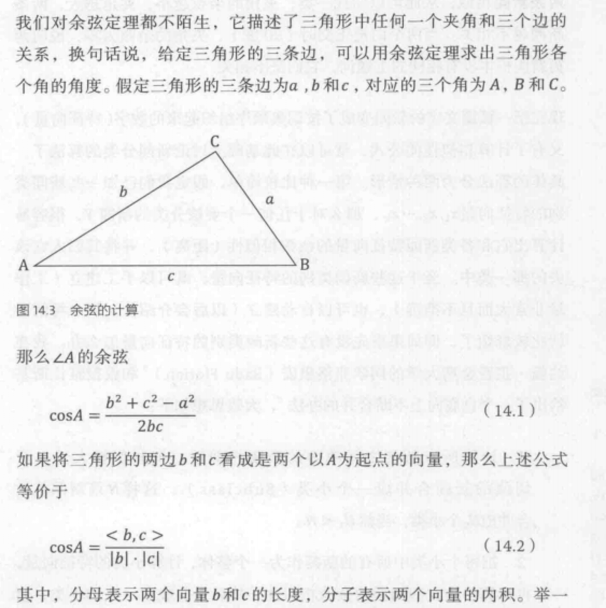

#### 由于向量中的每一个变量都是正数，因此余弦的取值在 0 和 1 之间。也就是说夹角在 0 度到 90 度之间。当两条新闻向量夹角余弦等于 1 时，这两个向量的夹角为零，两条新闻完全相同；当夹角的余弦接近于 1 时，这两条新闻相似，从而可以归为一类；夹角的余弦值越小，夹角越大，两条新闻越不相关。当两个向量正交时（90 度），夹角的余弦值为零，说明两篇新闻根本没有相同的主题词，他们毫不相关。

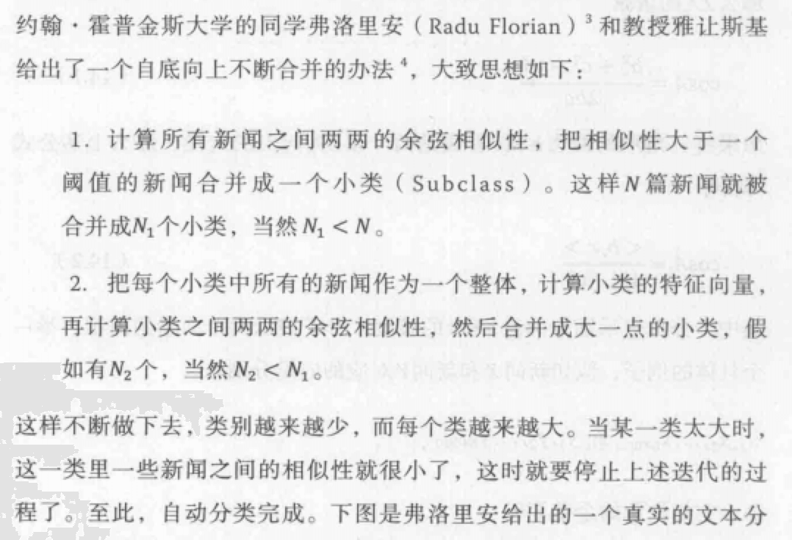

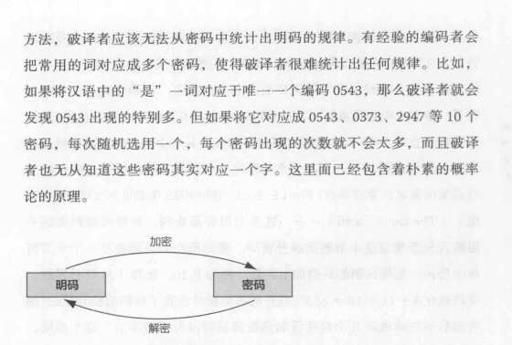

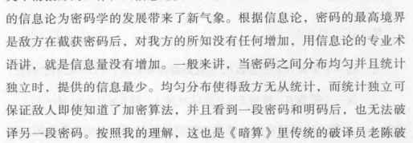

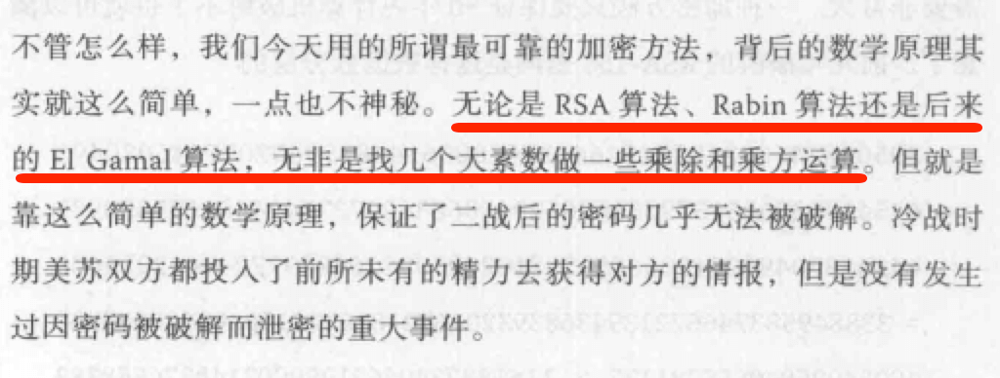

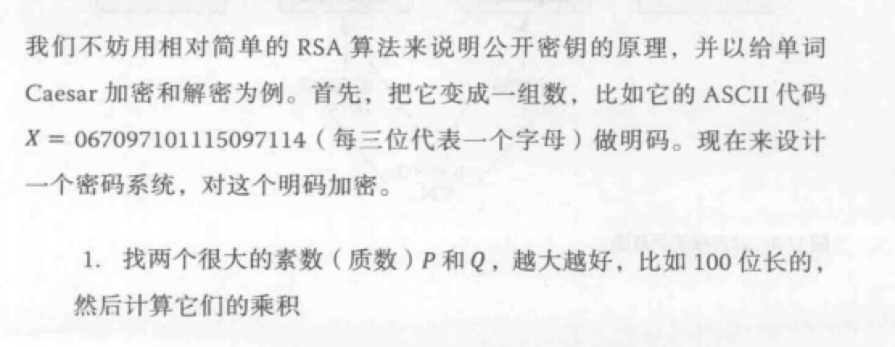

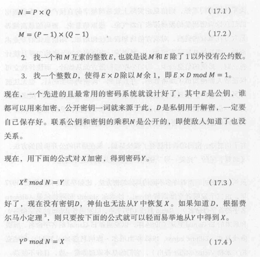

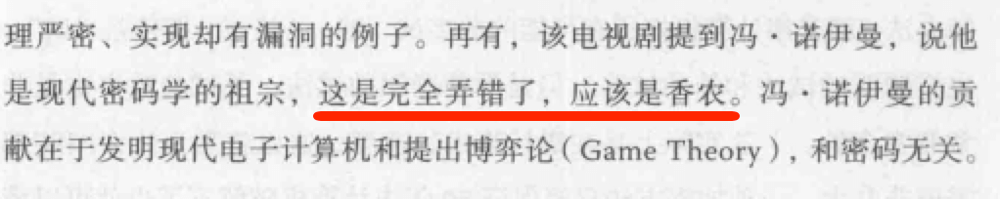

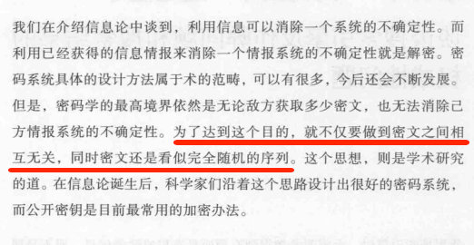

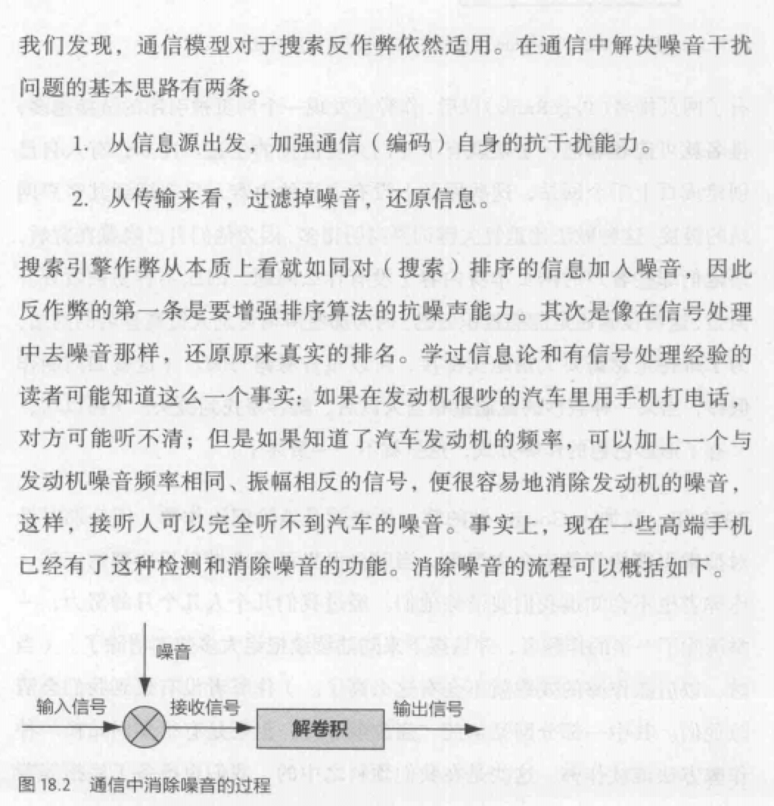

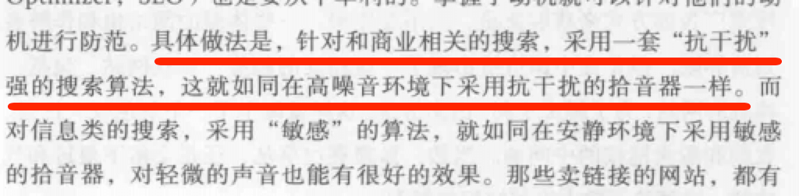

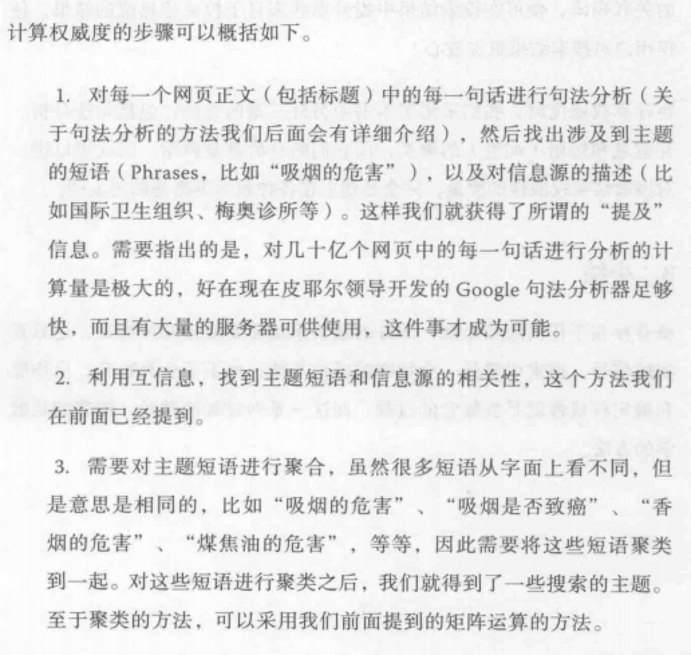

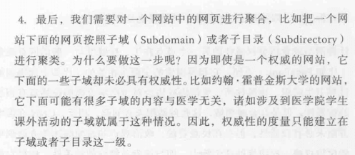

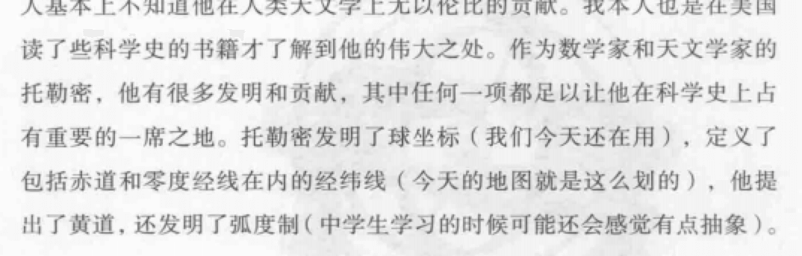