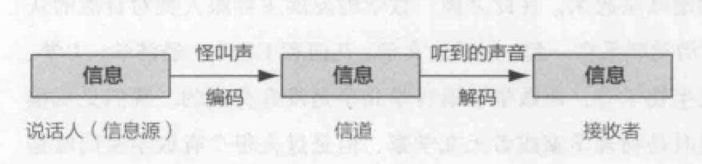
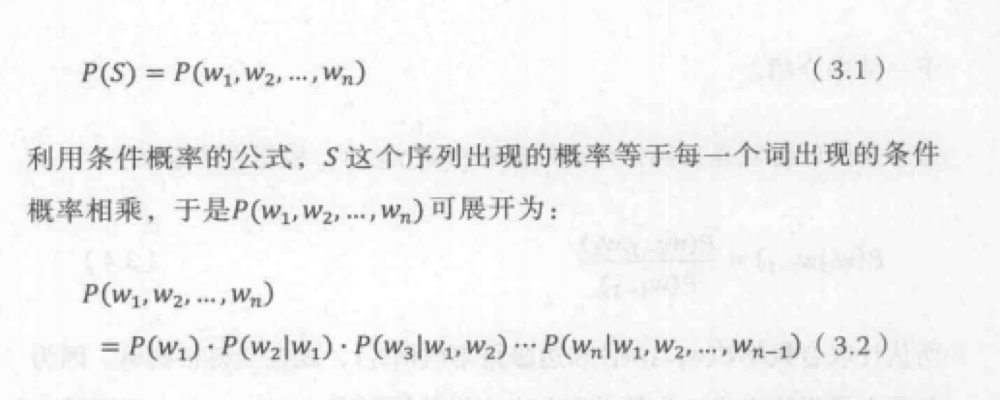
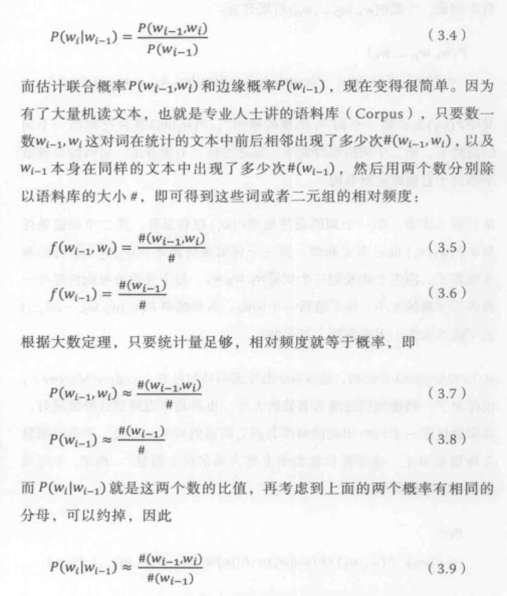
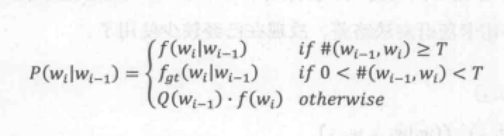
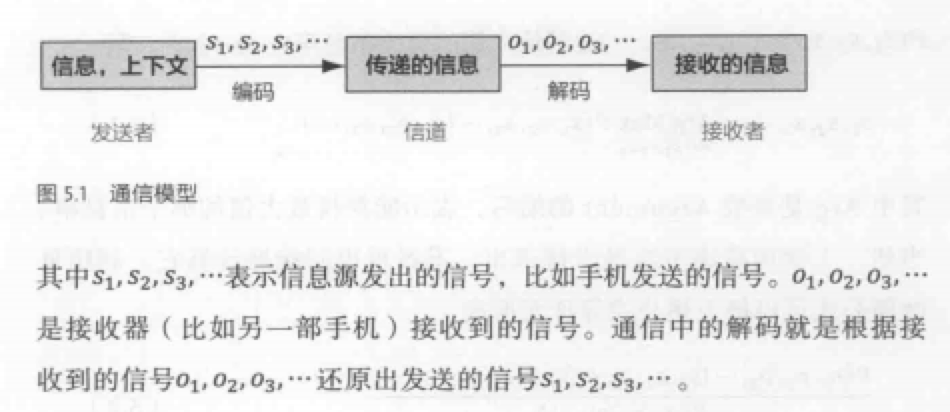
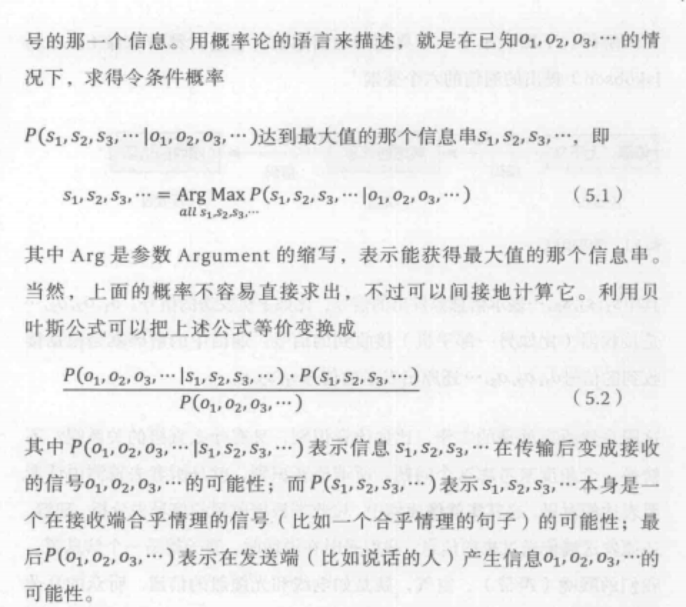

# 数学之美

自身感觉读了之后的体会，数学真的是一门总结性的和抽象性的学科。作者的能力也很强，将一些很高大上的东西，用一些很通俗的语音来讲，明白易懂。即照顾了普通读者的兴趣，有兼顾了专业读者对深度的要求。发现在大学里面讲的东西还是非常有用的，线性代数、离散数学、概率论还有余弦定理啥的。只可惜当时没有好好学习哇。

计算机自然语言处理可以抽象成非常简单的通信模型和统计学模型，然后用一个简单条件概率公式加上一个马尔可夫假设就可以做到机器翻译和语音识别。

处理事情的方法和原则，先帮用户解决主要的问题，再决定要不要纠结在次要的部分上；要知道修改代码的所作所为，知其所以然；能用简单的方法解决就用简单的。

## 1. 数学和语言 vs 数学和信息

- 通信等原理和信息传播的模型

    
    联想---密码学

- 语言和文字

        人类仅靠大脑已经记不住所有词汇，于是高效记录信息的需求就产生了，就是文字啦。

- 自然语言处理或者机器学习相似的聚类起源

        随着文明的进步，信息量增加，埃及象形文字数量不再随文明的发展而增加了。
        联想---代码里面的提取公共类方法

- 歧义性

        文字按照意思聚类的话，最终会带来歧义性。弄不清一个多义字在特定环境下它到底代表其中的哪个含义。解决方法依靠上下文。
        联想---代码里面的变量的声明、搜索、翻译。

- 不同文明下的人的通信

        翻译可以达成，仅仅是不同文字系统在记录信息上的能力是等价的。
        解释说明：文字只是信息的载体，而非信息本身，可以用其他载体存储同样意义的信息。这就是通信的基础。
        联想---小程序框架的编译能力、谷歌翻译

- 罗塞塔石碑

        1. 信息的冗余是信息安全的保障（联想---信息备份）
        2. 语言的数据（语料）双语或多语语料对翻译的重要性，是机器翻译研究的基础。（联想---中学的翻译书）

- 十进制

        因为人有十个指头，早期数字没有书写格式，掰手指。（小学）
        逢十进一，对数量的编码。
        二十进制，玛雅文明，一个世纪四百年
        [为啥](https://www.zhihu.com/question/25039466/answer/212095592)20 * 18 * 20 * 20。2012 是之前太阳纪的最后一年。

- 数字编码的解码规则

        中国: 乘法。200 万的写法含义 2 * 100 * 10000
        罗马: 加减法。小数字出现在大数字的左边为减，右边为加。 IV 表示 5-1=4; VII 表示 5+2=7; IIXX 表示 20-2=18。罗马人写 100 万。
        古印度人: 包括 0 在内的 10 个阿拉伯数字。（标志数字和文字的分离，客观上也让自然语言的研究和数学在几千年里没有重合的轨迹）

- 最短编码原理实践

        常用字短，生僻字长

- 罗马式的语言（西方的拼音文字）

        由腓尼基人将楔形文字简化为 22 个字母，在古希腊和罗马人的扩张中发展

- 信息科学的一些基本原理

        在通信的时候，如果信道较宽，信息不必压缩就可以直接传递；如果信道很窄，信息在传递前尽可能压缩，然后再接收端进行解压缩。（文言文、白话）

- 校验码

        犹太人抄写圣经时，把每一个希伯来字母对应一个数字，这样每行文字加起来便得到一个特殊的数字，这个数字便成为了这一行的校验码。查看校验码和原文是否对应。（80% => 95%或者更多）

## 2. 自然语言处理

- 语言的数学本质

        通过某种语言表达一种意思，用这种语言的编码方式对头脑中的信息做了一次编码，编码的结果是一串数字，如果对方懂得这门语言的解码方式，就能获得说话人表达的信息。
        （联想---中国人之间的对话，与外国人的对话）

- 图灵测试

        如果人无法判断自己交流的对象是人还是机器，就说明这个机器有智能。

- 自然语言处理两个阶段

        1. 20 世纪 50 年代到 70 年代，对计算机处理自然语言的认识都局限在人类学习语言的方式上，用电脑模拟人脑。（语法分析，语义分析）
           - 真实语句的文法规则数量庞大，不能覆盖
           - 自然语言会在演变的过程中产生词义和上下文相关的特性，自然语言的文法是比较复杂的上下文有关文法，而程序语言是认为设计的，便于计算机解码的上下文无关文法。
        2. 基于数学模型和统计的方法
            - 初衷是解决语音识别问题。核心模型是通信系统加隐含马尔可夫模型（中国的古诗）

- 小结

        基于统计的自然语言处理方法，在数学模型上和通信是相通的。科学家用了几十年才认识到这个联系。

## 3. 统计语言模型

- 计算机处理自然语言

        一个基本的问题就是为自然语言这种上下文相关的特性建立数学模型

- 用数学的方法描述语言特性

        某个有意义的句子 S 在文本中出现的可能性，也就是 S 的概率 P(S)

    

- 马尔可夫假设

      假设任意一个词 wi 出现的概率只同它前面的词 wi-1 相关。

     **二元模型**

$$ P(S)=P(w_1)\cdot P(w_2|w_1)\cdot P(w_3|w_2)\cdots P(w_n|w_{n-1}) \ (3.3) $$

- 马尔可夫假设 延伸

      马尔可夫在 1906 年首先做出了这类过程。而将此一般化到可数无线状态空间是由科尔莫果洛夫在 1936 年给出的。

     条件概率 $P(w_i|w_{i-1})$ 可估计为：

    

- 实例

      Google 的罗塞塔系统 2007 年第一次参加 NIST 的评测，这个仅仅开发两年的系统战胜了已经开发十几年的基于规则的系统。
      （联想---技术能力）

- 高阶语言模型 - $N$元模型

  假定文本中的每个词 $w_i$ 和前面 $N-1$ 个词有关，而与更前面的词无关。

  $N$ 元模型的大小（空间复杂度）几乎是 N 的指数函数，即 O(|V|^N^); |V| 是一种语言词典的词汇量

  $N=1$的一元模型实际上是一个上下文无关的模型。

  $N$ 从 2 到 3 时，模型效果上升显著；

  $N$ 从 3 到 4 时，模型效果提升不是很显著，耗费的资源却非常快；

$$ P(w_i|w_1,w_2,\ldots,w_{i-1})=P(w_i|w_{i-n+1},w_{i-n+2},\cdots,w_{i-1})\ \ \ \ \ \ \ (3.10) $$

- 局限性

        在自然语言中，上下文之间的相关性可能跨度非常大，甚至从一个段落跨到另一个段落，不能覆盖这种语言现象。依赖长程的依赖性（使用步步传导，通过指数衰减控制步长的影响，来降低梯度下降困难的影响）来解决这个问题。[http://www.zhuanzhi.ai/document/0c0c67ecef691188a7856a5d541b2b96]

- 模型的训练、零概率问题和平滑方法

        模型参数：使用语言模型需要知道模型中所有的条件概率
        模型的训练：通过对语料的统计，得到这些参数的过程。
        正确的训练一个语言模型：增加数据量

        实际应用中，统计语言模型的零概率问题是无法回避的，训练统计语言模型的艺术就在于解决好统计样本不足时的概率估计问题。
        古德 - 图灵估计：对于没有看见的事件，不能认为它发生的概率就是零，我们从概率的总量中分配一个很小的比例给这些没有看见的事件，至于小多少是根据“越是不可信的统计折扣越多”的方法进行。

假定预料库中出现$r$次的词有$N_r$个，未出现的词量数为$N_0$，语料库大小为$N$。
 $$ N=\sum_{r=1}^{\infty} rN_r $$
出现$r$次的词在整个语料库中的相对频度 *（Relative Frequency）* 是 $r/N$。以相对平度作为这些词的概率估计。

 当$r$比较小时，需要用更小的概率$d_r$估计出现$r$次的词的概率。

 $$ d_r=(r+1)\cdot N_{r+1}/N_r<r\cdot N_r/N_r\ \sum_{r}d_r\cdot N_r=N $$

 根据 Zipf's Law，$r$越大，词的数量$N_r$越小，即$N_{r+1}<N_r$。在实际的自然语言处理中，一般对出现次数超过某个阈值的词，频率不下调，只对出现次数低于阈值的词下调频率。下调得到的频率总和给未出现的词。

 对于二元组$(w_{i-1},w_i)$的条件概率估计$P(w_i|w_{i-1})$做古德-图灵估计。

 

 其中$T$是一个阈值，一般在8-10左右，函数$f_{gt}()$表示经过古德-图灵估计后的相对频度。

$$Q(w_i-1)=\frac {1-\sum_{w_i seen} P(w_i|w_{i-1})}{\sum_{w_i unseen}f(w_i)}$$

因为一元组($w_i$)出现的次数平均比二元组($w_{i-1},w_i$)出现的次数要多很多，根据大数定理，他的相对频度更接近概率分布。低阶语言模型和高阶模型进行线性插值来达到平滑的目的。

用低阶语言模型和高阶语言模型进行线性插值来达到平滑的目的 - 删除插值。

- 语料的选取

      1. 在训练数据和应用数据一致并且训练量足够大
      2. 训练之前有时需要对训练数据进行预处理

- 小结

      数学的魅力在于将复杂的问题简单化

## 4.谈谈分词

- 中英文分词

        1. 西方拼音语言，词之间有明确的分界符
        2. 亚洲语言需要先对句子进行分词，才能做进一步的自然语言处理。

- 分词方法

        1. 查字典（不足-复杂句子）
        2. 最少词数的分词理论（不足-歧义性）
        3. 统计语言模型（解决了分词二义性）

        利用统计语言模型计算出每种分词后句子出现的概率，并找出其中概率最大的，就能找到最好的分词方法。

        将分词看成是一个 动态规划（疑问） 的问题，并利用 维特比算法 （疑问）快速地找到最佳分词。

        机器翻译中，颗粒度应该大一些，语音识别和网页搜索中，应该小一些。

        统计语言模型的局限性：很大程度上是依照“大众的想法”，或者“多数句子的用法”，而在特定情况下，可能是错的。

- 分词的一致性

        在不同的应用中，经常是一种词的切分比另一种更有效。不同人对词的切分看法上差异性很大。衡量好坏的方法可以根据分词的结果和人工切分的来比较。

- 词的颗粒度和层次

        一个分词器同时支持不同层次的词的切分，需要一个基本词表和一个复合词表，然后要基本词表和复合词表各建立一个语言模型，L1 和 L2。用基本词表和语言模型 L1、复合词表和语言模型 L2 分别进行分词。词表和语言模型这两个数据库变了，但是分词器（程序）本身和前面的完全相同。

- 分词的准确性

        1. 错误
            - 越界性错误
            - 覆盖性错误
        2. 颗粒度不一致
            - 做数据挖掘，不断完善复合词的词典

## 隐含马尔可夫模型

- 通信模型

- 自然语言处理

  $s_1,s_2,s_3,\cdots$表示信息源发出的信号。$o_1,o_2,o_3,\cdots$表示接收器接收到的信号。根据接收端的观测信号来推测信号源发生的信息，需要从所有的源信息中找到最可能产生出观测信号的那个信息。
  
  

   一旦信息$o_1,o_2,o_3,\cdots$产生了就不会改变，因此$P(o_1,o_2,o_3,\cdots)$就是一个可以忽略的常数。上述公式可以等价为：
   $$ P(o_1,o_2,o_3,\cdots|s_1,s_2,s_3,\cdots)\cdot P(s_1,s_2,s_3,\cdots) $$

- 隐含马尔可夫链：

从相对静态的随机变量到随机变量到时间序列$s_1,s_2,s_3,\cdots,s_t,\cdots$，即随机过程（动态）。首先，在任意一个时刻$t$，对应的状态$s_t$都是随机的。第二，任一状态$s_t$的取值都可能和周围其他的状态相关。马尔可夫提出一种简化假设，即随机过程中各个状态$s_t$的概率分布只与它的前一个状态$s_{t-1}$有关，即$P(s_t|s_1,s_2,s_3,\cdots,{s_t-1})=P(s_t|s_{t-1})$。符合这个假设的随机过程被称为马尔可夫过程，或马尔可夫链。

- [隐含马尔可夫模型](https://www.zhihu.com/question/20962240)

 任意时刻$t​$的状态$s_t​$不可见。观察者无法通过观察一个状态序列$s_1,s_2,s_3,\cdots,s_t​$来推测转移概率等参数。但隐含马尔可夫模型在每个时刻$t​$会输出一个符号$，o_t​$且$o_t​$仅跟$s_t​$相关（独立输出假设）。基于马尔可夫假设和独立输出假设，某个特定状态序列$s_1,s_2,s_3,\cdots​$产生输出符号$o_1,o_2,o_3,\cdots​$的概率为：

 $$ P(s_1,s_2,s_3,\cdots,o_1,o_2,o_3,\cdots)=\prod t P(s_t|s{t-1})\cdot P(o_t|s_t) $$

 将马尔可夫假设和独立输出假设应用：
 $$ P(o_1,o_2,o_3,\cdots|s_1,s_2,s_3,\cdots)=\prod_t P(o_t|s_t) $$

 $$ P(s_1,s_2,s_3,\cdots)=\prod_t P(s_t|s_{t-1}) $$
  在公式中$P(s_1,s_2,s_3,\cdots)$是语言模型。转移概率 *（Transition Probability）：$P(s_t|s_{t-1})$。生成概率（Generation Probability）* ：$P(o_t|s_t)$。

- 隐含马尔可夫的三个基本问题

      1. 给定一个模型，如何计算某个特定的输出序列的概率。 (Forward-Backward算法)
      2. 给定一个模型和某个特定的输出序列，如何找到最可能产生这个输出的状态序列。(维特比算法)
      3. 给定足够量的观测数据，如何估计隐含马尔可夫模型的参数